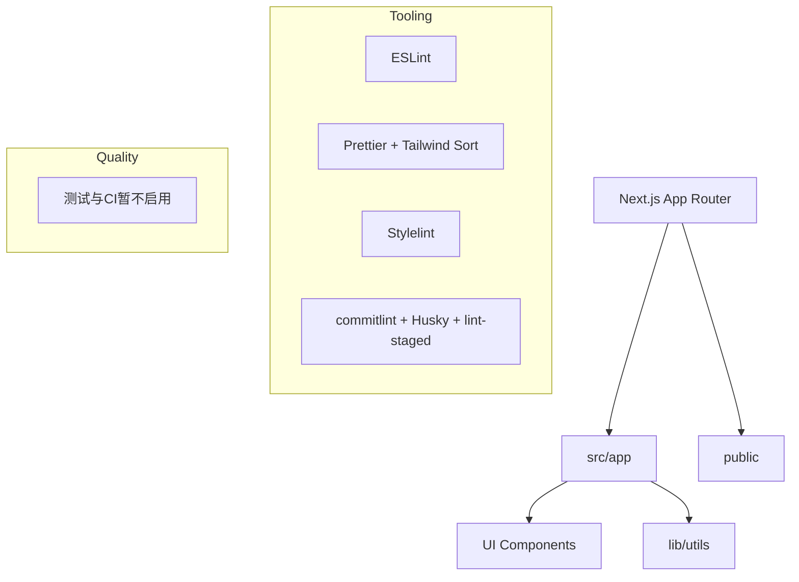
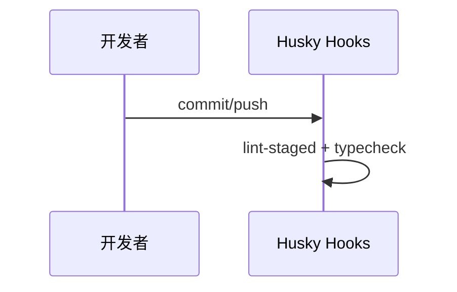

# 架构设计

## 总体架构

## 技术栈

- **前端:** Next.js (App Router) + React + TypeScript
- **样式:** Tailwind CSS + shadcn/ui
- **包管理:** pnpm + corepack
- **质量:** ESLint/Prettier/Stylelint（当前不启用自动化测试）
- **CI:** 当前阶段不启用

## 核心流程

## 重大架构决策

完整的 ADR 存储在各变更的 `how.md` 中，本章节提供索引。

| adr_id  | title                                | date       | status   | affected_modules | details                                                                                                                       |
| ------- | ------------------------------------ | ---------- | -------- | ---------------- | ----------------------------------------------------------------------------------------------------------------------------- |
| ADR-001 | 统一 pnpm + corepack + Node v22.22.0 | 2026-01-18 | ✅已采纳 | tooling          | [详情](../history/2026-01/202601180308_frontend-engineering-setup/how.md#adr-001-统一-pnpm--corepack--node-v22220)            |
| ADR-002 | commitlint + cz-git + Husky 门禁     | 2026-01-18 | ✅已采纳 | tooling          | [详情](../history/2026-01/202601180308_frontend-engineering-setup/how.md#adr-002-采用-commitlint--cz-git--husky-形成提交门禁) |
